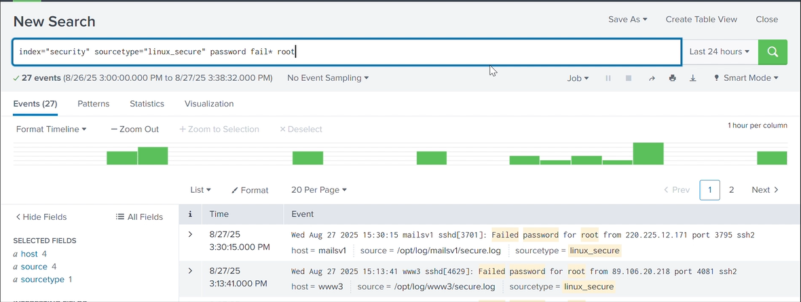
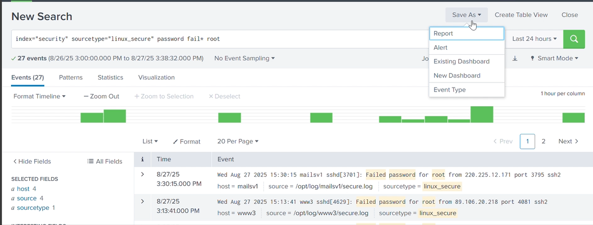
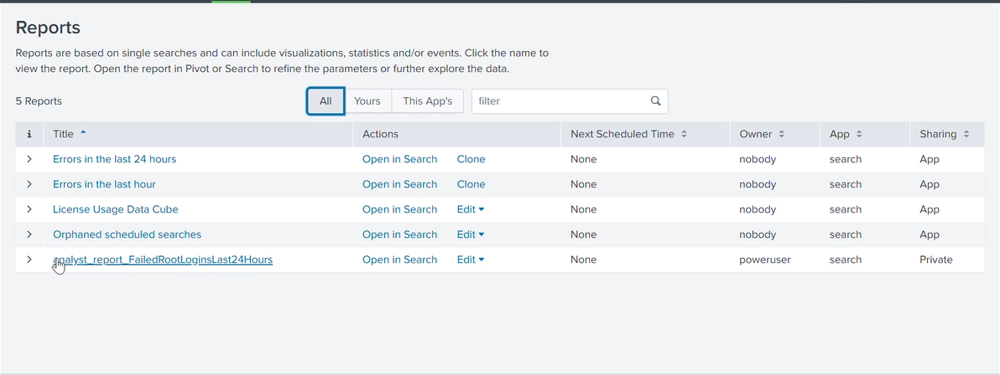
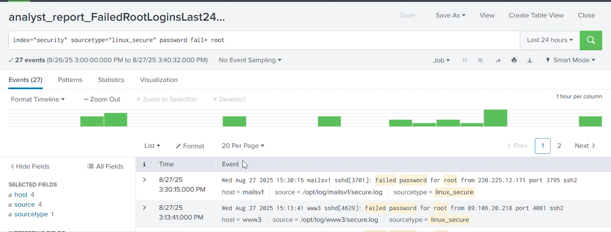

# Lab 1 — Splunk Reports & Base Searches  

**Goals:**  
- Run a base search in Splunk.  
- Save searches as reports.  
- View and confirm saved reports.  

---

## What I Did  
- Ran a base search using `index=security`.  
- Saved the search as a report.  
- Viewed the saved report in the Reports dashboard.  

---

## Evidence

### Step 1 — Base search executed

### Step 2 — Save As menu opened

### Step 3 — Save Report dialog (title & description)

### Step 4 — Reports listing showing new report

### Step 5 — Opened report page

---

## Skills Demonstrated  
- **Splunk base searching**  
- **Report creation**  
- **Dashboard navigation**  
