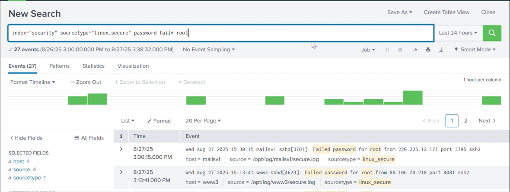
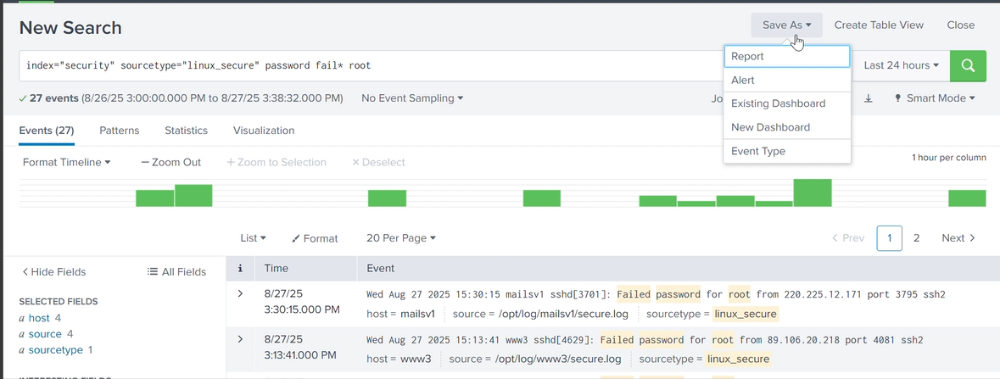
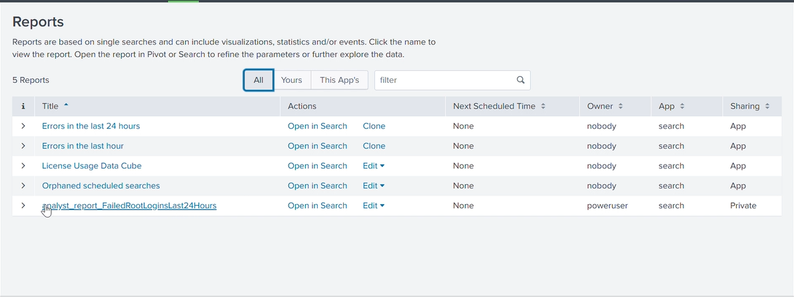
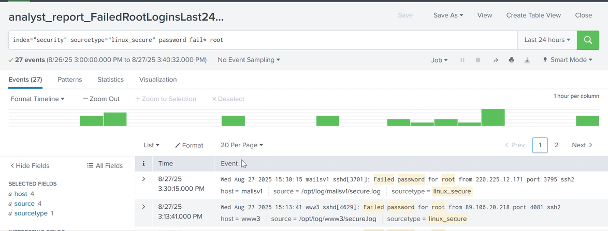

# Splunk Labs Portfolio

This repository contains hands-on labs I’ve completed while learning **Splunk** for security monitoring, reporting, and log analysis. Each lab includes step-by-step notes and screenshots to demonstrate practical skills.

## 📌 Purpose
- Build technical proficiency with Splunk (search, reporting, dashboards).
- Practice skills relevant to IT Helpdesk, SOC Analyst, and SysAdmin roles.
- Provide portfolio evidence for recruiters and hiring managers.

## 🛠 Tools Used
- Splunk Enterprise (free/training version)
- Windows 10 Virtual Machine
- Sample log data (failed logins, system events, etc.)

## 🗂 Labs Included

### [Lab 1 — Save a Search as a Report](Lab1-Save-Search-Report/README.md)
- Objective: Learn to execute searches and save them as reports.
- Evidence: Screenshots of search execution, saved reports, and verification.

### [Lab 2 — Using Fields & Wildcards](Lab2-Fields-Wildcards/README.md)
- Objective: Practice searching with fields and wildcards to filter logs.
- Evidence: Screenshots of queries and results.

### [Lab 3 — Leveraging Lookups & Subsearches](Lab3-Lookups-Subsearches/README.md)
- Objective: Use lookup tables and subsearches to enrich and correlate data.
- Evidence: Screenshots of lookup usage and subsearch results.

*(Additional labs will be added as I progress.)*

## 📸 Evidence

## Evidence

### Step 1 — Ran base search

### Step 2 — Save As menu

### Step 3 — Save Report dialog

### Step 4 — Reports listing

### Step 5 — Opened report page

