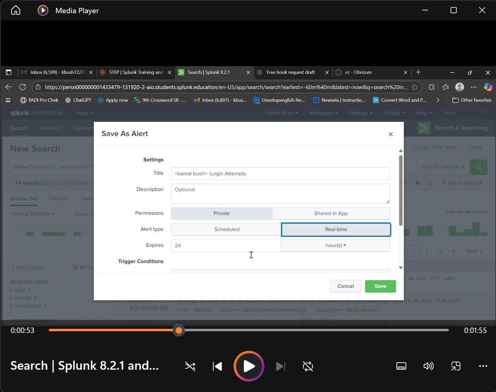
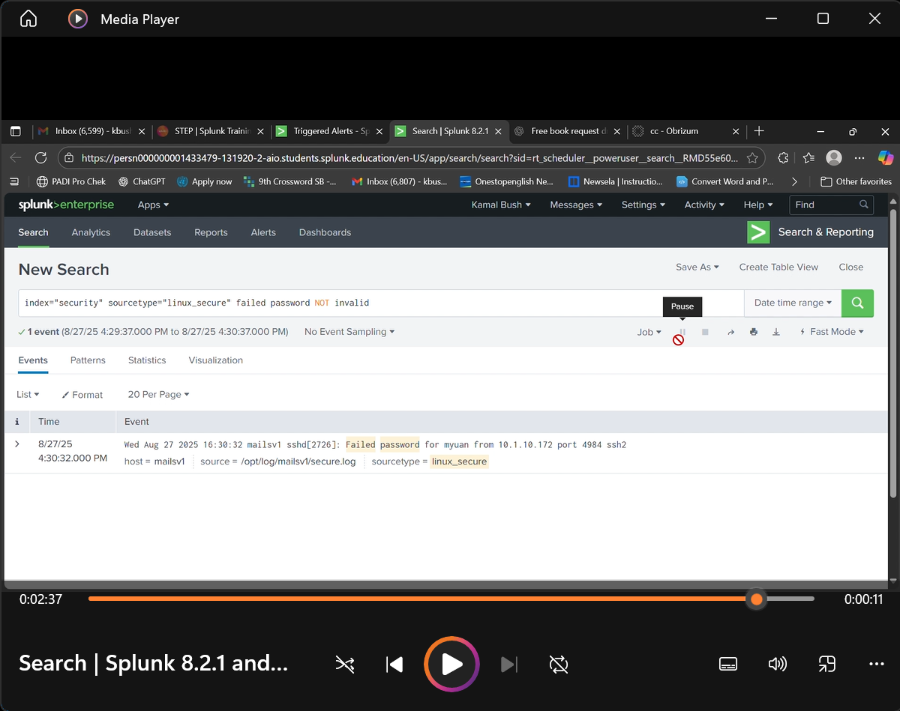
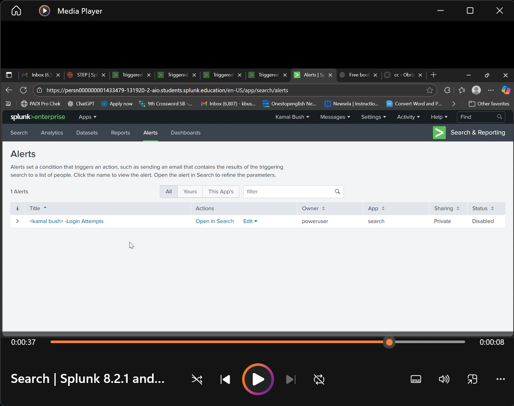
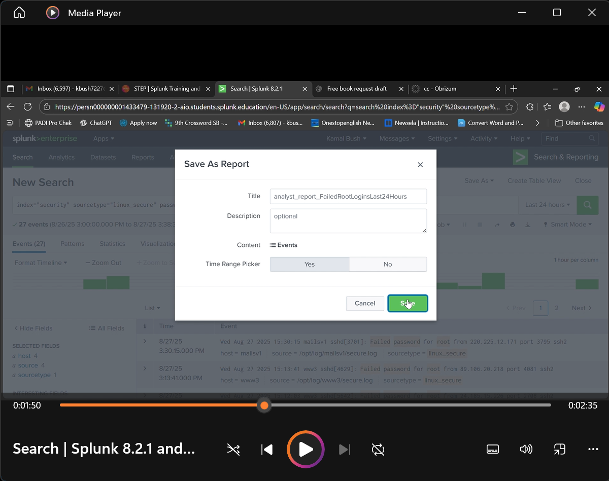
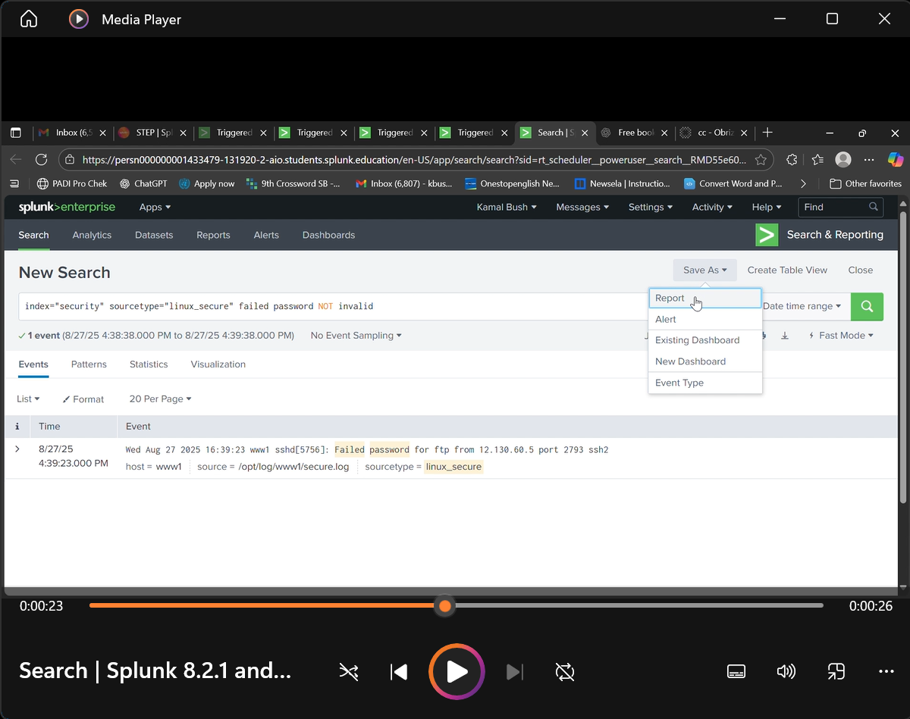
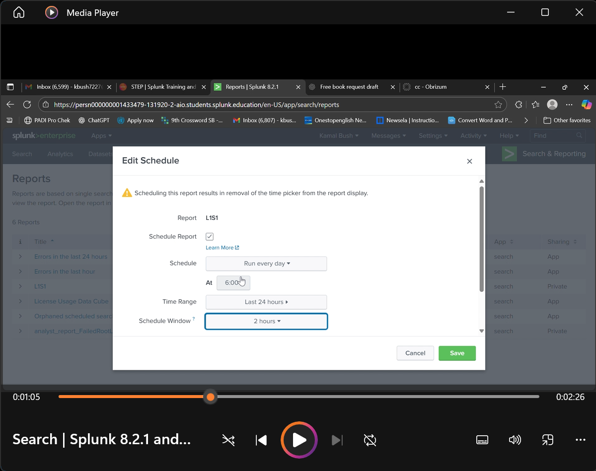

# Splunk Lab 2 — Splunk Alerts & Reports

## Goals
- Create and manage alerts.  
- Save searches and alert results as reports. 
- Schedule a report to run daily at a set time.
- Practice SOC-relevant Splunk functions.  

---

## What I Did
- Created a new alert based on failed login attempts. 
- Viewed and verified the alert in the Alerts dashboard.  
- Disabled the alert after testing.  
- Saved a search as a report.  

---

 ## Evidence  

### Step 1 — Created new alert (Failed Logins)  
  

### Step 2 — Viewed the alert in Alerts dashboard  
  

### Step 3 — Disabled alert after testing  
  

### Step 4 — Saved search as a report  
  

### Step 5 — Saved alert results as report  
  

### Step 6 — Scheduled report at 6:00 a.m.  
  

---

## Commands Used
index=security sourcetype=linux_secure "failed password"

---

## Skills Demonstrated

Splunk alert creation & management

Report building & scheduling

Automated monitoring workflows

Search query refinement

SOC-ready alerting/reporting practices

Saved the alert results as a separate report.

Scheduled the Failed Logins Report to run daily at 6:00 a.m.

